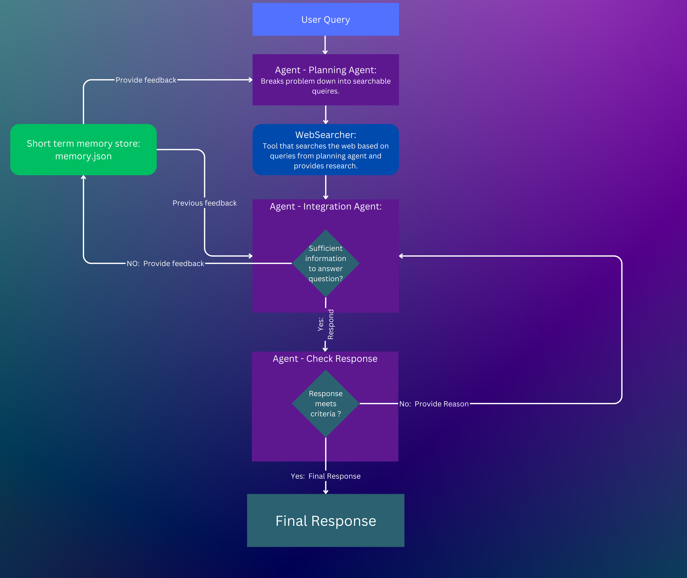
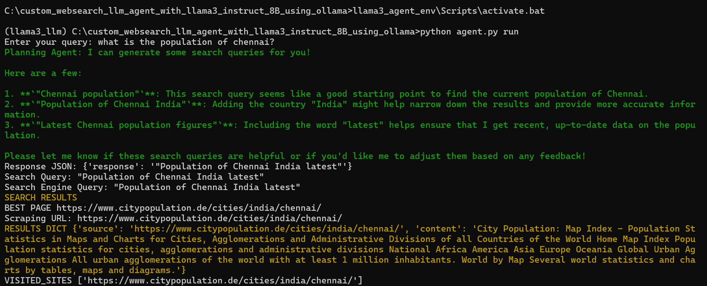
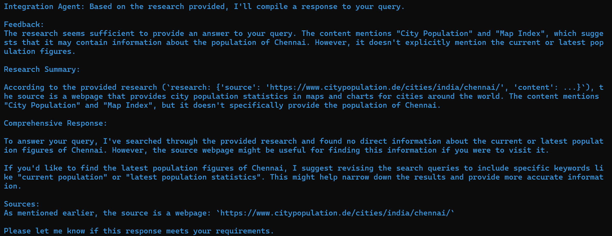
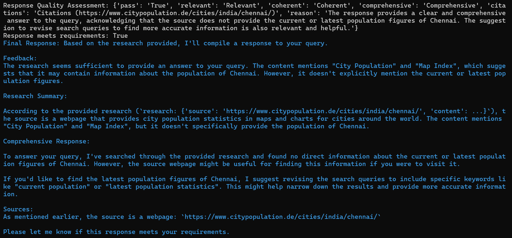

# Custom Agent

A custom websearch agent useable with Ollama, OpenAI and vLLM.

### Prerequisites

#### Environment Setup

1. **Create a Virtual Environment using pip:**
   ```bash
   python -m venv llama3_agent_env
   ```
   
3. **Activate the Virtual Environment:**
   ```bash
     llama3_agent_env\Scripts\activate.bat
   ```
#### Setup Ollama Server
1. **Download Ollama:**
   Download [https://ollama.com/download](Ollama)

2. **Download an Ollama Model:**
   ```bash
   curl http://localhost:11434/api/pull -d "{\"name\": \"llama3\"}"
   ```
Ollama[https://github.com/ollama/ollama/blob/main/docs/api.md#list-local-models](API documentionation)

### Clone and Navigate to the Repository

1. **Navigate to the Repo:**
   ```
   cd /path/to/your-repo/custom_websearch_llm_agent_with_llama3_instruct_8B_using_ollama
   ```

2. **Install Requirements:**
   ```
   pip3 install -r requirements.txt
   ```

### Configure API Keys

1. **Open the `config.yaml`:**
   ```
    config.yaml
   ```

2. **Enter API Keys:**
   - **Serper API Key:** Get it from [https://serper.dev/](https://serper.dev/)
   
### Agent Schema:



### Run Your Query
```
python agent.py run
```
Then enter your query.

Here the query passed 'what is the population of chennai' ?

chennai wikipedia [https://en.wikipedia.org/wiki/Chennai]

#### Planning agent 

Planning agent created 3 different queries for the input passed .



#### Integration agent 

Integration agent takes the queries from planning agent and checks whether it has the sufficient information to answer User custom query.



#### Final Response  

If there was sufficient information, Integration agent compiles a response from the best sites visited.
Quality assessment will be made on the integration agent response and a final response will be created if the criteria is met.

